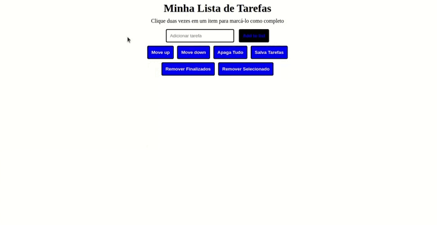
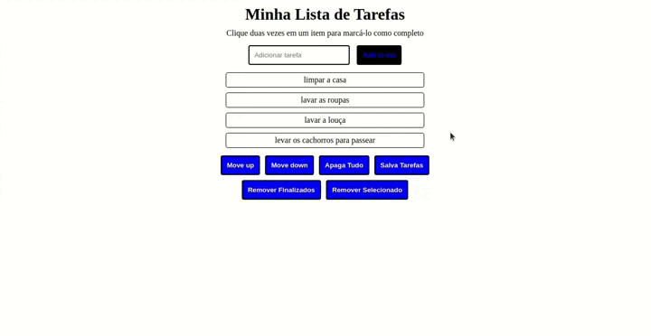
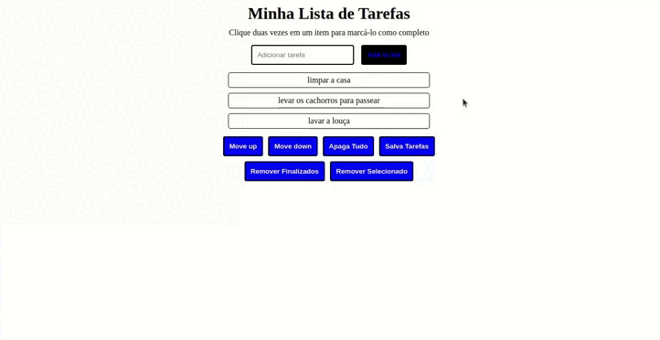
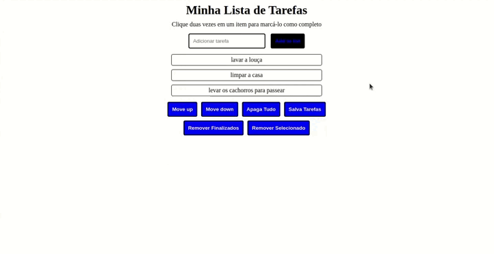

## Descrição do Projeto
Neste projeto eu desenvolvi uma aplicação onde é possível adicionar tarefas, seleciona-las, move-lás para cima e para baixo na lista, marcar como finalizadas, remover finalizadas, remover todas as tarefas, além de poder salva-lás.

---

## Tecnologias utilizadas
Para desenvolver a página foi utilizado HTML5, a estilização foi realizada com CSS3 e a lógica de funcionamento foi utilizado JavaScript.

---

## Instalação do projeto localmente
Após cada um dos passos, haverá um exemplo do comando a ser digitado para fazer o que está sendo pedido, caso tenha dificuldades, mande mensagem para o meu e-mail _humberto_bonadiman@hotmail.com_.

1. Abra o terminal e crie um diretório no local de sua preferência com o comando **mkdir**:
```javascript
  mkdir projetos-humberto
```

2. Entre no diretório que acabou de criar e depois clone o projeto:
```javascript
  cd projetos-humberto
  git clone git@github.com:Humberto-Bonadiman/Project-todo-list.git
```

3. Abra o diretório do projeto clonado e dê duplo clique no arquivo index.html e o projeto vai abrir em seu navegador, não é necessário instalar nada mais.

---

## Ilustrações com o funcionamento

Adicionar tarefa a lista




Selecionar, mover para cima e para baixo e remover tarefa selecionada




Marcar como finalizada e remover tarefa finalizada




Deletar todas as tarefas



---

## Requisitos do projeto

## Requisitos Obrigatórios:

### 1 - Adicione à sua lista o título "Minha Lista de Tarefas" em uma tag <header>

### 2 - Adicione abaixo do título um pequeno e discreto parágrafo com id="funcionamento" e com o texto "Clique duas vezes em um item para marcá-lo como completo"

### 3 - Adicione um input com o id="texto-tarefa" onde a pessoa usuária poderá digitar o nome do item que deseja adicionar à lista

### 4 - Adicione uma lista ordenada de tarefas com o id="lista-tarefas"

### 5 - Adicione um botão com id="criar-tarefa" e, ao clicar nesse botão, um novo item deverá ser criado ao final da lista e o texto do input deve ser limpo

### 6 - Ordene os itens da lista de tarefas por ordem de criação

### 7 - Clicar em um item da lista deve alterar a cor de fundo do item para cinza rgb(128,128,128)

### 8 - Não deve ser possível selecionar mais de um elemento da lista ao mesmo tempo

### 9 - Clicar duas vezes em um item, faz com que ele seja riscado, indicando que foi completo. Deve ser possível desfazer essa ação clicando novamente duas vezes no item

    Pontos importantes sobre este requisito:

    * Crie uma classe CSS com o nome "completed" e defina a propriedade "text-decoration" com o valor "line-through".

    * Utilize a classe CSS "completed" para adicionar o efeito de letra tachada (riscada) às tarefas finalizadas.

### 10 - Adicione um botão com id="apaga-tudo" que quando clicado deve apagar todos os itens da lista

### 11 - Adicione um botão com id="remover-finalizados" que quando clicado remove **somente** os elementos finalizados da sua lista

## BÔNUS

### 12 - Adicione um botão com id="salvar-tarefas" que salve o conteúdo da lista. Se você fechar e reabrir a página, a lista deve continuar no estado em que estava

### 13 - Adicione dois botões, um com id="mover-cima" e outro com id="mover-baixo", que permitam mover o item selecionado para cima ou para baixo na lista de tarefas

    Pontos importantes sobre este requisito bônus:

    * Antes de começar a desenvolver essa funcionalidade, pare e pense. O que significa mover um item de uma lista para cima ou para baixo no **_DOM_**? Você já possui todas as habilidades necessárias para fazer isso.

    * Habitue-se a pensar nos casos especiais ao construir programas. O que acontece se o usuário tentar mover o primeiro item para cima ou o último para baixo?

### 14 - Adicione um botão com id="remover-selecionado" que, quando clicado, remove o item selecionado
